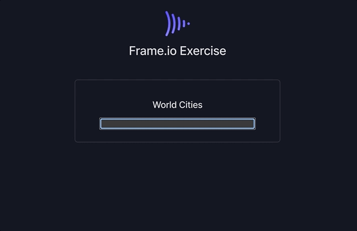

# Frame.io Frontend Take Home Exercise

Hi there, 👋

Thank you for applying for a frontend position at Frame.io! We realize you probably have many other time committments, so we'll try to keep this short. Please plan to spend no more than 4 hours on your submission. At the 4 hour mark, please feel free to wrap up your work and describe any further improvements you'd make in `SOLUTION.md`.

This test is designed for engineers of all levels and degrees of familiarity with our tech stack. If you're like us, you'll see many things you wish you could improve. We ask that you focus first on the core tasks below, then include any additional improvements if you have the time.

If your submission meets our requirements, a Frame.io engineer will pair with you to continue working on it, as a part of the "on site" interviews. Together, we'll debug any issues we find and add some more small features. We do this to mimic how we work on real projects together.

If you have any questions at any point during the exercise, please reach out to your Adobe Talent Partner.

## Overview

We've set up a simple React application. It showcases a Search component with Autocomplete/Type-ahead capability. Typing in a search query will display a list of matching results in a dropdown.

To see this component in action, let's set up the repo. We use `yarn`, but `npm` should also work if you prefer.

1. Run `yarn` to install dependencies
2. Run `yarn dev` to start our development server
3. Open `http://localhost:3000` in your browser

Type "queen" in the input, and you'll see a list of world cities that contain the string "queen".

Currently the component can only query a static data array, the user must use a mouse click to select an item, and it looks terrible 🙈. That's where you come in!

## Tasks

The exercise consists of 4 tasks, roughly in order of importance for our evaluation.

### 1. Improve Render Performance

We strive to build UI that animates at 60fps and responds within 100ms of a user interaction. Try a few searches and you can see that this component feels a little sluggish. Without changing the dataset, are there any improvements we could make to make it faster?

### 2. Async Results

Extend the `SearchWithAutocomplete` component to allow fetching results asynchronously from an external source. Start by wiring up the component to Github's REST API. Use the endpoint `https://api.github.com/search/users?q=${ query }&per_page=${ numOfResults }` to display a list of Github users with usernames that match the query.

### 3. Styles

Style the components to match our design spec (below).

Every day, Frame.io engineers collaborate closely with our incredibly talented designers. This design is a starting point, not a comprehensive spec. So feel free to add animation, UX behaviors, or any other ideas you have, time permitting. Pretend you'll be showing the result of your exercise to your design partner for further iteration.

### 4. Keyboard shortcuts

Using the `Up/Down` keys should navigate the results in the dropdown. Pressing the `Enter` key should select the highlighted result.

## Notes & Requirements

- You _can_ modify anything, but you shouldn't _need_ to make drastic changes to provide a great solution. As a reference, many stellar submissions only modify files in the `src/components` and `src/hooks` directories. The main entrypoint for the app is `src/pages/index.tsx`.
- Your submission should render at least two instances of the component, one using static data and one using dynamic, remote results.
- The component should be reusable for any data source, not just Github's API. Imagine that we plan to use this component in our application for other use cases.
- All existing tests should pass.
- We'll evaluate your submission in the latest Chrome, so don't worry too much about cross-browser compatibility.
- You may add small utility packages if you need them, but please avoid larger libraries, such as Redux. We want to see as much of your code as we can!
- We're using Next.js, Typescript, and Styled Components to simulate our real stack. But don't worry if you're not familiar with them, you won't be evaluated on how you use them.
  - Typescript - Our configuration is intentionally flexible and allows for standard JavaScript. But if you find yourself with Typescript errors, feel free to remove the types and change the extension to `.jsx`.
  - Styled Components - We've included Styled Components as a convenience, but there is also a vanilla CSS file at `public/styles.css` that's already included on the page. We don't have a preference; use the one you're more comfortable with.
  - Next.js - You shouldn't need to modify Next.js-related code or settings.
- Document your component in `SOLUTION.md`. Pretend you're passing off this project to a teammate and want to make sure they're successful.
- We'll assume your submission reflects what you can accomplish in about 4 hours.
- Please use any and all resources at your disposal, such as reference documentation or Stack Overflow. If you use code that was written prior to this exercise (by your or someone else) please clearly mark it as such in your comments.
- Overall, we hope that your submission demonstrates your stengths when building high quality applications on the web.

## Submission

We use blind evaluation where possible, so please don't use your name/email in the code.

1. Share any additional context about the submission in `SOLUTION.md`
2. Run `yarn zip`, which will zip up all files into `frameio_submission.zip`.
3. In the Frame.io project where you downloaded this prompt, upload the `frameio_submission.zip`.
4. Email your Adobe Talent Partner to let them know you're done.

Thanks again for taking the time to complete this exercise. We look forward to talking with you about it soon!
